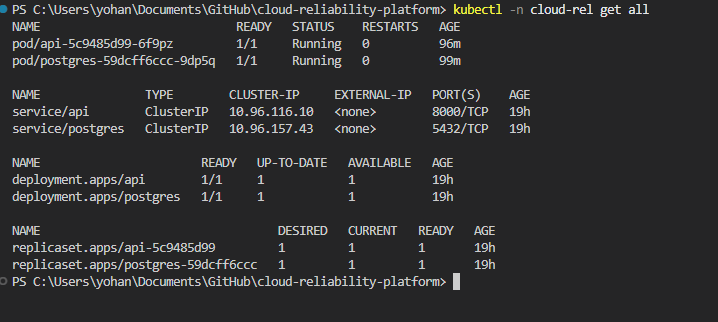

# Architecture Overview

This project runs a small production-like service inside Kubernetes
and focuses on reliability and observability rather than feature depth.

---

## System Architecture

A high-level view of the Cloud Reliability Platform running on Kubernetes, showing the API + database path and the observability stack used for monitoring.

*Figure: Kubernetes-based architecture with API + PostgreSQL and observability using Prometheus & Grafana*

## Components

- **API Service**
  - FastAPI application
  - Runs on Uvicorn (ASGI server)
  - Exposes health, readiness, and metrics endpoints

- **Database**
  - PostgreSQL
  - Deployed as a separate Kubernetes workload

- **Kubernetes**
  - Deployments manage desired state
  - Services provide stable networking
  - Pods are disposable and self-healed

---

## Runtime Flow

Client  
→ kubectl port-forward / Service  
→ API Pod  
→ PostgreSQL Service  
→ PostgreSQL Pod  

---

## Containerized Application Runtime

The API is packaged as a Docker container and runs using Uvicorn.

*Figure: Docker image built and application container running locally*

## Kubernetes Deployment State

The API and database run as separate workloads inside Kubernetes.

*Figure: Kubernetes Deployments and Services created for API and database*

*Figure: kubectl get all showing Deployments, Services, ReplicaSets, and Pods in the application namespace*

## Health & Readiness

- `/healthz`
  - Indicates application liveness
- `/readyz`
  - Indicates dependency readiness (database)
- `/metrics`
  - Prometheus-compatible metrics

This separation ensures traffic is gated safely during failures.
