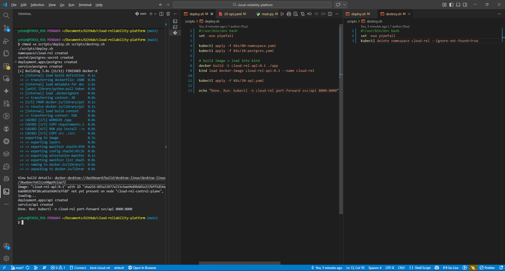
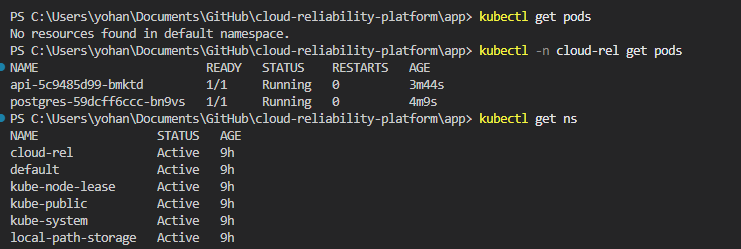

# Architecture Overview

This project runs a small production-like service inside Kubernetes
and focuses on reliability and observability rather than feature depth.

---

## Components

- **API Service**
  - FastAPI application
  - Runs on Uvicorn (ASGI server)
  - Exposes health, readiness, and metrics endpoints

- **Database**
  - PostgreSQL
  - Deployed as a separate Kubernetes workload

- **Kubernetes**
  - Deployments manage desired state
  - Services provide stable networking
  - Pods are disposable and self-healed

---

## Runtime Flow

Client  
→ kubectl port-forward / Service  
→ API Pod  
→ PostgreSQL Service  
→ PostgreSQL Pod  

---

### Containerized Application Runtime

The API is packaged as a Docker container and runs using Uvicorn.

### Kubernetes Deployment State

The API and database run as separate workloads inside Kubernetes.

## Health & Readiness

- `/healthz`
  - Indicates application liveness
- `/readyz`
  - Indicates dependency readiness (database)
- `/metrics`
  - Prometheus-compatible metrics

This separation ensures traffic is gated safely during failures.
