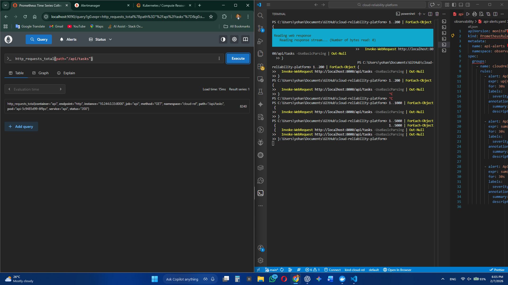
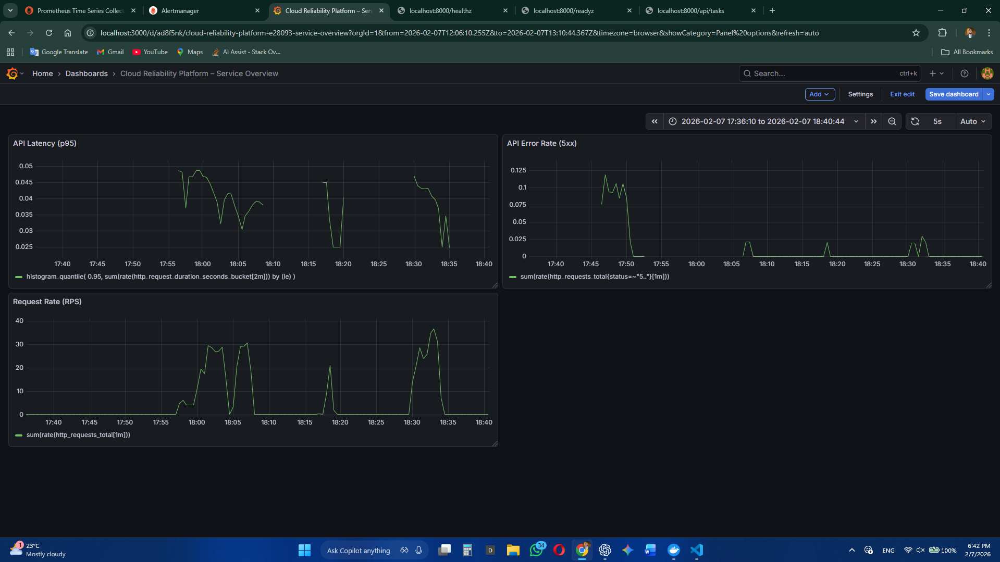
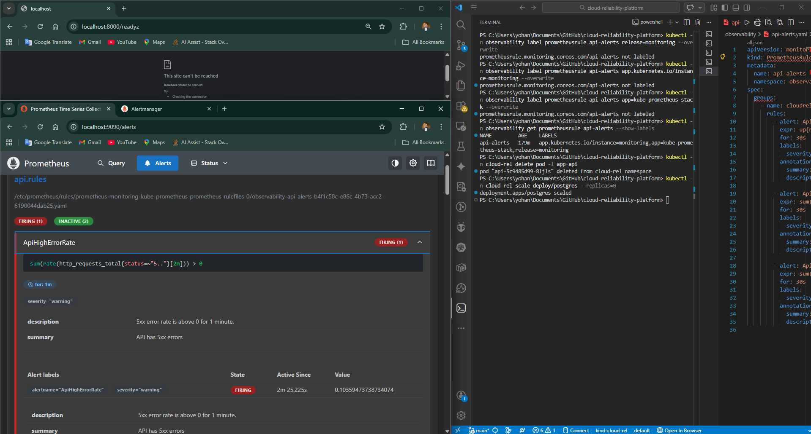

# Observability & Monitoring – SRE Deep Dive

This project uses the **Prometheus Operator (kube-prometheus-stack)**
to provide metrics collection, alerting, and visualization.

The focus is on **service reliability**, not infrastructure noise.

---

## Monitoring Stack

- Prometheus – metrics collection and evaluation
- Grafana – dashboards and visualization
- Alertmanager – alert delivery
- Prometheus Operator – CRD-based configuration

---

## Metrics Instrumentation

The API exposes `/metrics` using prometheus-client.

Key metrics:
- http_requests_total
- http_request_duration_seconds_bucket

Metrics are scraped using a **ServiceMonitor** targeting the API Service.

---

## Custom Grafana Dashboard – Service Overview

A custom Grafana dashboard was designed around **SRE Golden Signals**.

### Golden Signals Used

- **Traffic** – request rate
- **Errors** – 5xx error rate
- **Latency** – p95 request latency

This allows quick answers to:
> Is the service healthy from a user’s point of view?

---

## Dashboard Behavior During Incidents

During simulated failures:
- Pod deletion
- Database unavailability

Observed effects:
- Traffic drops or fluctuates
- Error rate spikes
- Latency p95 increases
- Metrics return to baseline after recovery

This validated:
- Alert correctness
- Kubernetes self-healing
- Observability accuracy

---

## Prometheus Alerting Debugging (Key Learning)

Custom PrometheusRule alerts were initially not evaluated.

### Root Cause
Prometheus Operator loads rules **only if labels match**
the kube-prometheus-stack release configuration.

### Resolution
Aligned custom PrometheusRule labels with stack labels:
- release=monitoring
- app.kubernetes.io/instance=monitoring
- app=kube-prometheus-stack

### Result
- Rules appeared in Prometheus
- Alerts fired correctly
- Alertmanager received alerts

---
## Prometheus Metrics Validation

Application metrics were queried directly from Prometheus.

*Figure: http_requests_total showing both successful and failed requests*

## Custom Grafana Dashboard – Service Overview

A custom Grafana dashboard was built using SRE Golden Signals.

*Figure: Grafana dashboard showing request rate, error rate, and p95 latency*

## Alert Validation

Custom alerts were validated during failure scenarios.

*Figure: ApiHighErrorRate alert firing during simulated failure*

## SRE Takeaway

Observability is not just dashboards.

It is the ability to:
- Detect failures
- Explain impact
- Validate recovery

This project demonstrates observability as an **operational tool**,
not a reporting feature.
