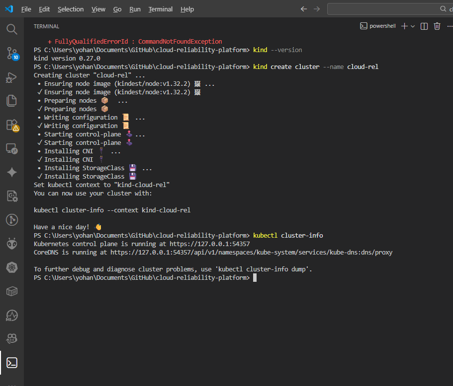

# PROCESS.md  
Cloud Reliability Lab

This document records the **process followed** to design, deploy, validate, and analyze a Kubernetes-based service using **Site Reliability Engineering (SRE) principles**.  
It is an internal engineering log focused on **decisions, actions, and observations**, not usage instructions.

---

## 1. Project Intent

The objective of this project was to practice **SRE fundamentals** using a deliberately simple service.  
Application complexity was intentionally kept minimal to allow focus on:

- Reliability
- Kubernetes behavior
- Health checking
- Observability
- Failure handling
- Operational documentation

---

## 2. Repository Initialization

A new GitHub repository was created and structured before any application or infrastructure logic was added.

The repository was organized to separate:
- Application code
- Kubernetes manifests
- Automation scripts
- Documentation
- Runbooks

This structure was chosen to resemble production-grade repositories and to encourage maintainability and clarity from the start.

---

## 3. Application Selection and Design

A minimal FastAPI service was selected as the application workload.

The application was designed to:
- Expose basic API functionality
- Connect to a PostgreSQL database
- Provide health and readiness signals
- Expose metrics for observability

The application logic was intentionally simple, as the goal was to study system behavior rather than application features.

---

## 4. Containerization

The FastAPI application was containerized to create a consistent and portable runtime environment.

Uvicorn was used as the application server, and the container was verified to start reliably and expose the expected endpoints.

Containerization allowed the application to be treated as an immutable unit within Kubernetes.

---

## 5. Kubernetes Deployment Strategy

A dedicated Kubernetes namespace was created to isolate all project resources.

PostgreSQL was deployed as a separate workload, independent from the application, to reflect real-world service separation and enable isolated failure testing.

The FastAPI application was deployed using Kubernetes Deployments and Services, ensuring stable service discovery and pod management.

## Kubernetes Cluster Setup

A local Kubernetes cluster was created using kind to simulate cloud behavior.

*Figure: Local Kubernetes cluster initialized using kind*

---

## 6. Service Exposure and Validation

The application was accessed through Kubernetes Services to validate internal routing and connectivity.

The following aspects were verified:
- Pod scheduling and stability
- Service-to-pod communication
- Application startup behavior
- Database connectivity from the application

---

## 7. Health Checking Strategy

Liveness and readiness probes were configured for the application.

Liveness checks were used to detect crashed or unresponsive containers.

Readiness checks were used to control when traffic is sent to a pod, ensuring that only fully initialized and healthy pods receive requests.

This separation allowed safer deployments and more predictable recovery behavior.

---

## 8. Observing Kubernetes Behavior

The system was observed under normal and restarted conditions to understand Kubernetes reconciliation behavior.

After restarting the local environment, Kubernetes automatically restored all workloads to their desired state without manual intervention.

This confirmed Kubernetes’ self-healing and declarative state management properties.

---

## 9. Observability Setup

Metrics were exposed from the application and an observability stack was deployed.

The process included:
- Ensuring metrics endpoints were reachable
- Understanding how Prometheus discovers targets
- Investigating label-based selection mechanisms
- Verifying that observability depends on correct configuration, not defaults

Grafana was verified as operational and prepared for future dashboard creation.

---

## 10. Reliability Experiments

Controlled failures were introduced to observe system behavior.

When application pods were terminated, Kubernetes automatically recreated them and maintained service availability.

When the database was disrupted, application errors were observed until the database recovered, after which normal operation resumed.

These experiments demonstrated recovery behavior, dependency impact, and the importance of readiness and health checks.

---

## 11. Automation

Deployment and teardown processes were automated to ensure repeatability.

Automation enabled consistent environment setup and reduced the risk of manual errors during testing and experimentation.

---

## 12. Documentation and Runbooks

Operational documentation and runbooks were created to capture:
- System architecture
- Observability considerations
- Incident scenarios and responses

These documents serve as a knowledge base for understanding and operating the system.

---

## 13. Architecture Summary

The final system followed a simple, layered architecture:

Client → Kubernetes Service → Pod → Uvicorn → FastAPI → PostgreSQL

This architecture was intentionally minimal to emphasize reliability and operational behavior over application complexity.

---

## 14. Key Learnings

- Reliability engineering does not require complex applications
- Kubernetes enforces desired state through continuous reconciliation
- Health probes are essential for traffic safety
- Observability must be deliberately configured
- Failure testing is a core SRE activity

---

## 15. Outcome

This project successfully demonstrates:
- Practical Kubernetes usage
- Core SRE principles
- Operational awareness
- Failure analysis and recovery behavior

The system serves as a foundation for further reliability and observability experiments.

